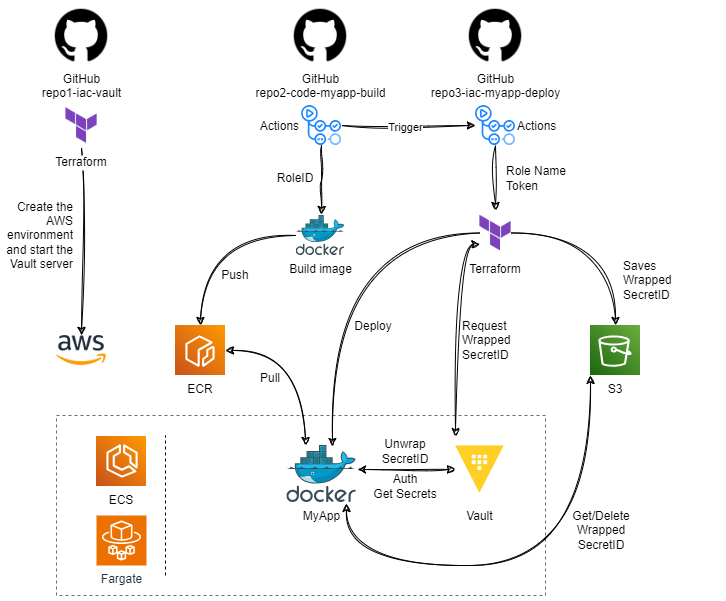

## DevOpsDays01-Vault



## About

The purpose of the demo is to provide an example use case for [HashiCorp Vault's AppRole authentication method](https://developer.hashicorp.com/vault/docs/auth/approle).

To facilitate the demonstration, only one Git repository organized into folders was used, but in a real environment, the ideal would be for each folder to be a different repository.

> Do not run a Vault dev server in production. This approach starts a Vault server with an in-memory database and runs in an insecure way.

| Resource | Link |
| --- | --- |
| Presentation given at DevOpsDays Montreal. | [Slides]() |

| Repository | Description |
| --- | --- |
| [repo1-iac-vault](/repo1-iac-vault/) | The infrastructure code (Terraform) that spins up a HashiCorp Vault container on AWS ECS with Fargate. |
| [repo2-code-myapp-build](/repo2-code-myapp-build/) | The test application code for building and publishing to the container registry (AWS ECR). |
| [repo3-iac-myapp-deploy](/repo3-iac-myapp-deploy/terraform/) | The infrastructure code (Terraform) that launches the test application container on AWS ECS with Fargate. |

|  |  |
| --- | --- |
| [GitHub Actions/Workflows](/.github/workflows) | Pipelines that automate application build and deployment steps. |

## Actions secrets and variables

Variable and secret configurations that need to be made in the GitHub repository for the workflows to run successfully.

| Type | Name | Description |
| --- | --- | --- |
| Variable | `VAULT_ADDR` | HTTP address of the Vault server. The DNS name will be shown in the output of the Terraform run that creates the environment in AWS. The value will be something like `http://<vault.address>:8200/` |
| Secret | `AWS_ACCESS_KEY_ID` | Specifies an AWS access key associated with an IAM account. |
| Secret | `AWS_SECRET_ACCESS_KEY` | Specifies the secret key associated with the access key. |
| Secret | `PAT` | The GitHub fine-grained `personal access token` with access to trigger the `repo3-iac-myapp-deploy` repo pipeline (permissions: `Read access to metadata` and `Read and Write access to contents`). |
| Secret | `ROLE_ID` | The RoleID generated by Vault for the application. |
| Secret | `VAULT_TOKEN` | The token generated by the Vault with access to request the wrapped SecretID. |

## AWS infrastructure - Vault deploy

Launch HashiCorp Vault using the [Terraform code](/repo1-iac-vault/):

> If you want to change the root access token (password) to the Vault, modify the value of the `hashicorp_dev_root_token` variable.

```sh
# create an S3 bucket to use as a Terraform backend
aws s3 mb s3://devopsdays-statefiles
aws s3 ls

# initialize terraform
cd repo1-iac-vault/
terraform init -backend-config=environment/dev/backend.tfvars

# display the execution plan, what will be changed
terraform plan -var-file=environment/dev/terraform.tfvars -var hashicorp_dev_root_token=root_pwd

# apply
terraform apply -var-file=environment/dev/terraform.tfvars -var hashicorp_dev_root_token=root_pwd
```

When you finish creating the AWS infrastructure, Terraform will display some output in the terminal.  
Note the value of the `load_balancer_dns` output, as it is the access address to the Vault and the test app.  
For example:

```sh
Outputs:

load_balancer_dns = "devopsdays-vault-ingress-1957212066.us-east-1.elb.amazonaws.com"
```

## Vault config

Configuring HashiCorp Vault to support the `AppRole authentication method` used to deploy the app.

### install Vault client or run a container with the client
- https://developer.hashicorp.com/vault/tutorials/getting-started/getting-started-install
- `docker run --rm -it --entrypoint sh hashicorp/vault:1.18`

```sh
# Set Vault environment variables
# This will configure the Vault client to talk to the dev server
export VAULT_ADDR='http://<load_balancer_dns>:8200'
export VAULT_TOKEN='root_pwd'
```

```sh
# Create some secrets for the app
vault kv put \
  -mount secret \
  pipelines/myapp/dev \
  DB_USER="user" DB_PASS="pass" DB_HOST="mydb-host.local" ADMIN_EMAIL="admin@devopsdays"

# Create a policy for the app to read the secrets
vault policy write app-myapp - << EOF
# MyApp - Read-only permission on secrets
path "secret/data/pipelines/myapp/dev" {
  capabilities = ["read"]
}
EOF

# Enable AppRole auth
vault auth enable approle

# Creates a role named myapp with app-myapp policy attached
vault write auth/approle/role/myapp \
  token_policies="app-myapp" \
  token_num_uses=5 \
  token_ttl=10m \
  token_max_ttl=20m \
  token_bound_cidrs="10.0.48.0/24","10.0.49.0/24" \
  token_no_default_policy=true \
  secret_id_ttl=10m \
  secret_id_num_uses=1 \
  secret_id_bound_cidrs="10.0.48.0/24","10.0.49.0/24"

# Get RoleID
vault read auth/approle/role/myapp/role-id

# MyApp identity/token - Can get the roles's secret-id
vault policy write approle-myapp-secret - << EOF
# This effectively makes response wrapping mandatory for this path by setting min_wrapping_ttl to 1 second.
# This also sets this path's wrapped response maximum allowed TTL to 300 seconds.
path "auth/approle/role/myapp/secret-id" {
    capabilities = ["update"]
    min_wrapping_ttl = "1s"
    max_wrapping_ttl = "300s"
}
EOF

# Create the identity with access to get the wrapped approle secretid
vault token create -orphan -policy=approle-myapp-secret -no-default-policy -ttl=87600h -display-name=MyAppIdentity
```

```sh
# If you want to test the AppRole flow manually:

# Retrieve a wrapped SecretID
VAULT_TOKEN="<the_token_with_access_to_get_wrapped_secretid>" vault write -wrap-ttl=300s -force -field=wrapping_token auth/approle/role/myapp/secret-id
# Unwrap the SecretID
vault unwrap -field=secret_id
# Authenticates usind the role_id and secret_id
vault write auth/approle/login role_id="<role_id>" secret_id="<secret_it>"
# Retrieve secrets
VAULT_TOKEN="<the_token_generated_with_approle_login>" vault kv get secret/pipelines/myapp/dev
```

## Deploy the app

Create a tag to trigger the app's build and deploy pipeline:

```sh
git tag v1
git push origin v1
```

Monitor the execution of the pipelines (Actions) through GitHub.

You can see in the terminal when the test application starts responding.  
The `/env` path should return a JSON with the secrets defined in the Vault:

```sh
while true; do
  curl http://<load_balancer_dns>/env
  echo ""
  sleep 3
done

# Example output before and after the app becomes available:
curl: (7) Failed to connect to devopsdays-vault-ingress-1957212066.us-east-1.elb.amazonaws.com port 80 after 232 ms: Couldn't connect to server
curl: (7) Failed to connect to devopsdays-vault-ingress-1957212066.us-east-1.elb.amazonaws.com port 80 after 232 ms: Couldn't connect to server
...
{"version":"v13","role_id":"3fb79e3d-a22f-59bc-3e75-d5580ce3a5e7","admin_email":"admin@devopsdays","db_host":"mydb-host.local","db_user":"user","db_pass":"pass"}
{"version":"v13","role_id":"3fb79e3d-a22f-59bc-3e75-d5580ce3a5e7","admin_email":"admin@devopsdays","db_host":"mydb-host.local","db_user":"user","db_pass":"pass"}
```

## Destroy the App and the AWS infrastructure

To destroy the app manually trigger the Action/Workflow `MyApp Undeploy (destroy)` (file `repo3-myapp-destroy.yml`) via the GitHub web interface.

```sh
# to destroy the infrastructure at the end of the tests
cd repo1-iac-vault/
terraform destroy -var-file=environment/dev/terraform.tfvars -var hashicorp_dev_root_token=root_pwd
```

### Thanks

Special thanks to the [DevOpsDays Montreal](https://www.linkedin.com/company/devopsdays-mtl/) team!
